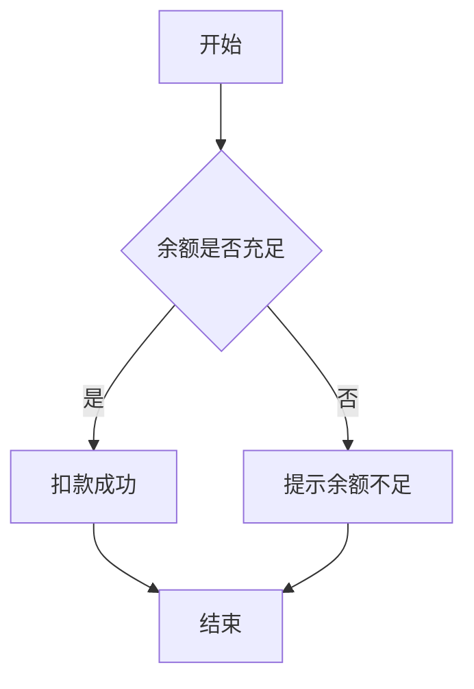

# mmd2uni

[](https://github.com/kvmaker/mmd2uni/actions/workflows/ci.yml)
[](https://www.npmjs.com/package/mmd2uni)
[](./LICENSE)

将 Mermaid 图表转换为终端 Unicode 字符图，并针对中文等宽字符做了双宽对齐修正。

## 简介

普通的 Mermaid ASCII 渲染器按“字符数”布局，遇到中文、日文假名、emoji 等宽字符就会错位；mmd2uni 在此基础上加了一层 CJK 补偿，保证方框、连线在终端里对齐。

例如以下决策流程图（源码见 `tests/fixtures/flow-cn-decision.mmd`）：



执行 `mmd2uni flow-cn-decision.mmd` 会渲染为：

```text
┌──────────────┐                     
│              │                     
│     开始     │                     
│              │                     
└───────┬──────┘                     
        │                            
        │                            
        │                            
        │                            
        ▼                            
◇──────────────◇                     
│              │                     
│ 余额是否充足 ├─────────────┐       
│              │             │       
◇───────┬──────◇            否       
        │                    │       
       是                    │       
        │                    │       
        │                    │       
        ▼                    ▼       
┌──────────────┐     ┌──────────────┐
│              │     │              │
│   扣款成功   │     │ 提示余额不足 │
│              │     │              │
└───────┬──────┘     └───────┬──────┘
        │                    │       
        │                    │       
        ├────────────────────┘       
        │                            
        ▼                            
┌──────────────┐                     
│              │                     
│     结束     │                     
│              │                     
└──────────────┘                     
```

## 安装

```bash
pnpm add -g mmd2uni
```

也可以不安装，直接用 `npx` 运行：

```bash
npx mmd2uni diagram.mmd
```

## 用法

```
mmd2uni [选项] [文件]
cat diagram.mmd | mmd2uni [选项]
```

不提供文件参数（或参数为 `-`）时从标准输入读取；只支持一个输入文件参数。

### 选项

| 选项 | 说明 |
| --- | --- |
| `--ascii` | 使用纯 ASCII 字符（`+ - \| >`）代替 Unicode 制表符 |
| `--color <模式>` | 颜色输出：`auto`\|`none`\|`ansi16`\|`ansi256`\|`truecolor`（默认 `auto`） |
| `-h`, `--help` | 显示帮助 |
| `-v`, `--version` | 显示版本号 |

### 退出码

| 退出码 | 含义 |
| --- | --- |
| 0 | 成功 |
| 1 | 解析/渲染错误 |
| 2 | 用法错误（参数错误、文件不存在、缺少输入等） |

## 支持的图表类型

mmd2uni 基于 [beautiful-mermaid](https://www.npmjs.com/package/beautiful-mermaid) 引擎渲染，并在其输出上叠加中文/宽字符对齐修正：

- **验收目标**（有 golden 基线与对齐性质测试覆盖，中文双宽对齐有保证）：flowchart（`graph`）、sequence（`sequenceDiagram`）
- **引擎附带能力**（beautiful-mermaid 原生支持，已验证可渲染但未做专项中文对齐测试）：class（`classDiagram`）、ER（`erDiagram`）、state（`stateDiagram-v2`）、xychart（`xychart-beta`）

## 中文对齐原理

Mermaid 的布局引擎按“字符数”计算列宽，终端却按“显示宽度”渲染——中文、日文假名、韩文、emoji 等宽字符要占 2 列，不处理就会导致方框和连线错位。

mmd2uni 的做法：渲染前把每个宽字符替换成一对私有区（PUA，`U+E000` 起）占位符，让布局引擎的列计算和最终显示宽度对齐；渲染完成后再逐字符还原成原始宽字符。

完整算法推导与容量分析见设计文档（位于源码仓库）：[`2026-07-06-mmd2uni-design.md`](https://github.com/kvmaker/mmd2uni/blob/master/docs/superpowers/specs/2026-07-06-mmd2uni-design.md) 第 5 节「CJK 补偿层算法」。

## 已知限制

- 边标签中的空格会被渲染为 `─`（上游 beautiful-mermaid 渲染怪癖），例如 `解析 header` 会显示为 `解析─header`
- `RL`（右到左）方向按 `LR` 处理（上游行为，暂不支持真正的从右到左布局）
- 单张图表的宽字符（中文、emoji 等）数量上限约 3200 个，超出会报错提示拆分图表（受 PUA 补偿层容量限制）
- `subgraph` 标题在框内并非严格居中（上游行为）

## 许可证

MIT
