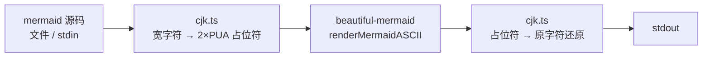

# mmd2uni 设计文档

日期：2026-07-06
状态：已确认

## 1. 目标

开发一个 CLI 工具 `mmd2uni`，将 mermaid 图表源码转换为终端可显示的 Unicode 字符图（制表符风格），**中文标签双宽对齐为一等公民**。

## 2. 需求范围

- 应用形态：CLI 命令行工具
- 图表类型：flowchart（实用集 + subgraph）、sequenceDiagram 为验收目标；底层引擎附带的 class / ER / state / xychart 视为免费能力，不做验收承诺
- 输入：文件路径参数或 stdin；输出：stdout
- 中文（CJK）标签必须在终端中严格对齐
- 非目标（YAGNI）：Markdown 文件内代码块提取、watch 模式、Web 界面、图片输出

## 3. 技术选型与决策记录

| 决策点 | 结论 | 理由 |
|---|---|---|
| 核心引擎 | [beautiful-mermaid](https://github.com/lukilabs/beautiful-mermaid) v1.1.3 | Craft 团队维护、10.5k stars、纯 TS 零 DOM 依赖、自带解析器，实测 flowchart/subgraph/sequence 全部可渲染 |
| 语言/运行时 | TypeScript / Node ≥ 20 | 引擎是 TS 库，同栈最短链路；放弃早期 Python 方案 |
| 包管理 | pnpm | 用户工具链标准 |
| 构建/测试 | tsup / vitest | 轻量主流 |
| 参数解析 | `node:util` parseArgs | 内置零依赖 |
| CJK 对齐 | 渲染前后补偿层（见 §5） | 实测引擎按 1 列布局汉字导致错位；补偿层验证 0 错位 |
| EAW Ambiguous 字符 | 按窄（1 列）处理 | 跟随主流终端默认行为 |
| emoji | 按宽（2 列）处理 | Emoji_Presentation / Extended_Pictographic |

### 已验证的引擎事实（2026-07-06 实测）

- `renderMermaidASCII(text, { useAscii, colorMode, ... })` 同步返回多行字符串
- 支持：TD/LR/BT 方向、subgraph、虚线边、边标签、矩形/圆角/圆形/菱形节点、sequence 生命线
- 缺陷 1（必须修补）：字符画布按 JS 字符计列，汉字错位 → 由补偿层解决
- 缺陷 2（可接受）：边标签中的空格渲染为 `─`；RL 方向按 LR 处理

## 4. 总体架构



### 模块划分

| 模块 | 职责 | 依赖 |
|---|---|---|
| `src/cli.ts` | 参数解析、文件/stdin 读取、退出码、中文错误信息 | render.ts |
| `src/render.ts` | 编排：mask → renderMermaidASCII → unmask | cjk.ts、beautiful-mermaid |
| `src/cjk.ts` | 宽字符判定、mask/unmask、显示宽度计算 | 无 |

运行时依赖仅 beautiful-mermaid 一个包。

## 5. CJK 补偿层算法

核心思路：布局引擎按「字符数」计列，终端按「显示宽度」渲染。将每个宽字符替换为 2 个私有区（PUA，U+E000 起）占位符，使引擎的列计算与最终显示宽度一致；渲染完成后逐字符还原。

$$
\begin{aligned}
&\textbf{input: } \text{src（mermaid 源码）} \\
&\textbf{output: } \text{对齐的 Unicode 字符图} \\
&1.\ \text{mask: 遍历 src 的每个码点 } c \\
&\quad 1.1.\ \text{若 } \mathrm{isWide}(c)\text{：分配连续 PUA 码点对 } (a,b)\text{，记录映射 } a \mapsto (c, b)\text{，输出 } ab \\
&\quad 1.2.\ \text{否则原样输出 } c \\
&2.\ \text{rendered} \leftarrow \mathrm{renderMermaidASCII}(\text{masked}, \text{options}) \\
&3.\ \text{unmask: 遍历 rendered 的每个码点} \\
&\quad 3.1.\ \text{遇到首占位符 } a\text{：输出原字符 } c\text{；若下一码点为配对 } b \text{ 则跳过} \\
&\quad 3.2.\ \text{遇到落单的配对占位符（被布局拆开）：输出空格兜底} \\
&\quad 3.3.\ \text{其余原样输出} \\
&\textbf{return } \text{out}
\end{aligned}
$$

`isWide(c)`：Unicode East Asian Width 为 W/F 的区段（CJK 统一表意文字、假名、谚文、全角形式等）或 emoji（Emoji_Presentation / Extended_Pictographic）。

每个占位符对使用唯一 PUA 码点（而非共享池），保证 unmask 无歧义；PUA BMP 区段 6400 个码点支持单图约 3200 个宽字符，超限时报错提示拆分图表。

## 6. CLI 接口

```bash
mmd2uni diagram.mmd          # 文件输入
cat diagram.mmd | mmd2uni    # stdin（无参数或参数为 - 时）
mmd2uni --ascii diagram.mmd  # 纯 ASCII 模式（+ - | >）
mmd2uni --color none         # 颜色：auto|none|ansi16|ansi256|truecolor，默认 auto
mmd2uni --help / --version
```

| 退出码 | 含义 |
|---|---|
| 0 | 成功 |
| 1 | mermaid 解析/渲染错误（stderr 输出中文说明 + 上游原始错误） |
| 2 | 用法错误（未知参数、文件不存在等） |

错误信息一律输出到 stderr，图输出到 stdout，保证管道纯净。

## 7. 错误处理

- 文件不存在 / 不可读 → 退出码 2，中文提示
- 引擎抛出解析异常 → 退出码 1，透传上游 message
- 空输入 → 退出码 1，提示「输入为空」
- PUA 占位符耗尽 → 退出码 1，提示图表过大

## 8. 测试策略

1. **单元测试（cjk.ts）**：mask/unmask 往返恒等性；宽字符判定边界（CJK、全角标点、emoji、组合字符、Ambiguous）
2. **Golden file 测试**：`tests/fixtures/*.mmd` → `tests/fixtures/*.expected.txt`，覆盖：中文 flowchart（决策/边标签）、LR 英文、subgraph、中文 sequence、虚线与多形状、中英混排
3. **对齐性质检查**：对所有 golden 输出逐行断言——同缩进的框边框行与内容行显示宽度一致（复用验证阶段的检查逻辑）
4. 开发遵循 TDD

## 9. 分发

- `package.json` 声明 `bin: { mmd2uni }`，`pnpm add -g` / `npx` 可用
- README 简体中文，含效果截图（代码块形式）

## 10. 开发流程

- git 分支开发（`feat/<topic>`），合并回 master 前经 coderabbit review
- 提交信息中文：`<类型>: <描述>`

## 11. 风险

| 风险 | 缓解 |
|---|---|
| beautiful-mermaid 上游 API 变更 | 锁定版本；补偿层与引擎解耦，仅依赖「字符串进出」契约 |
| 布局将占位符对拆开（如标签换行） | unmask 落单兜底为空格；golden 测试覆盖长标签用例 |
| 边标签空格渲染为 `─`（上游缺陷） | 记录已知问题；后续可向上游提 PR，不阻塞 v1 |
